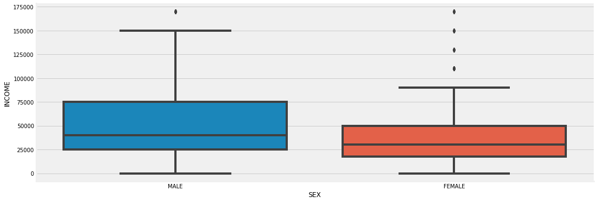

# Introduction

Submission for the Jan 2021 Citi Tech Hackathon. Univest is a two-sided marketplace for Income Share Agreements (ISAs). Students sign up and indicate how much money they need for tuition, then they get offers from investors and choose the best one. Investors submit offers to fund the ISA. They can expect extremely low risk and medium to high returns. 

In our MVP students can create a request for an ISA. This is posted to our backend and stored in a SQLite DB. Our machine learning algorithms then go to work calculating the expected yearly ROI over a 10 year timespan after graduation. Investors can search for this ISA requests and see the expected ROI.


# Data Analysis


### Aim:
To predict investor's return on investment (ROI).

### Strategy:
Use data that can be collected for college students (e.g. major, gender, number of siblings, political views) to train a model that will predict the student's future income after graduation. Use that prediction to calculate the expected ROI for the investor.

### Data:
The data used for the analysis and modelling was collected from General Social Survey ([GSS](https://gss.norc.org/)). 10 datasets ranging from the year 2000 to 2018 were combined. Only individuals who fit the target market were kept (individuals within the age range of 21 to 45 who attended college or above). 
The idea was to see what salaries these individuals were earning and then use back-datable features in the dataset (e.g. gender, parents' highest level of education) to create a model that can predict salaries using these features. As the features are back-datable we could ask for that information from our student clients and predict their future salary. That prediction is then used to determine the expected ROI.  

### Breakdown:

### [EDA, Visualization and Data Wrangling:](https://github.com/HexuanZhang-DS/income_share_agreements_roi/blob/data_analytics/EDA.ipynb)
A notebook containing the initial analysis of the data:

- Relationship between numerical features and income.
- Distributions of numerical features.
- Correlations (heatmap). 
- Relationship between categorical features and income -> our analysis showed that some unexpected datapoints such as the number of grandparents born in the USA correlates strongly with income post-graduation, so when the students sign up for an ISA we ask them this info. 
- Feature engineering -> dealing with null values, using predictive models to predict null values. 


### [Modelling, ML Regressors, Keras Feed Forward Neural Network:](https://github.com/HexuanZhang-DS/income_share_agreements_roi/blob/data_analytics/modelling.ipynb)

- Comparing regression models on a "large" dataset with predicted features.
- Comparing regression models on a "small" dataset without predicted features (dropna). 
- Artificial Neural Network 

__________________________________________________________________

### EDA, Visualization and Data Wrangling

#### Data Overview

<table class="tableizer-table">
<thead><tr class="tableizer-firstrow"><th></th><th>OCC10</th><th>SIBS</th><th>AGE</th><th>EDUC</th><th>PAEDUC</th><th>MAEDUC</th><th>DEGREE</th><th>PADEG</th><th>MADEG</th><th>MAJOR1</th><th>MAJOR2</th><th>DIPGED</th><th>SECTOR</th><th>BARATE</th><th>SEX</th><th>RACE</th><th>RES16</th><th>REG16</th><th>FAMILY16</th><th>MAWRKGRW</th><th>INCOM16</th><th>BORN</th><th>PARBORN</th><th>GRANBORN</th><th>POLVIEWS</th><th>INCOME</th></tr></thead><tbody>
 <tr><td>0</td><td>Broadcast and sound engineering technicians an...</td><td>1.0</td><td>26.0</td><td>16.0</td><td>16.0</td><td>16.0</td><td>BACHELOR</td><td>BACHELOR</td><td>GRADUATE</td><td>NaN</td><td>NaN</td><td>NaN</td><td>NaN</td><td>NaN</td><td>MALE</td><td>WHITE</td><td>CITY GT 250000</td><td>W. SOU. CENTRAL</td><td>MOTHER & FATHER</td><td>YES</td><td>NaN</td><td>YES</td><td>BOTH IN U.S</td><td>1.0</td><td>SLGHTLY CONSERVATIVE</td><td>$8 000 TO 9 999</td></tr>
 <tr><td>1</td><td>Advertising and promotions managers</td><td>6.0</td><td>44.0</td><td>14.0</td><td>12.0</td><td>12.0</td><td>JUNIOR COLLEGE</td><td>HIGH SCHOOL</td><td>HIGH SCHOOL</td><td>NaN</td><td>NaN</td><td>NaN</td><td>NaN</td><td>NaN</td><td>FEMALE</td><td>WHITE</td><td>BIG-CITY SUBURB</td><td>E. NOR. CENTRAL</td><td>MOTHER & FATHER</td><td>YES</td><td>NaN</td><td>YES</td><td>BOTH IN U.S</td><td>1.0</td><td>LIBERAL</td><td>$7 000 TO 7 999</td></tr>
 <tr><td>2</td><td>First-line supervisors of office and administr...</td><td>0.0</td><td>44.0</td><td>18.0</td><td>11.0</td><td>11.0</td><td>GRADUATE</td><td>HIGH SCHOOL</td><td>HIGH SCHOOL</td><td>NaN</td><td>NaN</td><td>NaN</td><td>NaN</td><td>NaN</td><td>MALE</td><td>WHITE</td><td>TOWN LT 50000</td><td>W. SOU. CENTRAL</td><td>MOTHER & FATHER</td><td>YES</td><td>NaN</td><td>YES</td><td>BOTH IN U.S</td><td>ALL IN U.S</td><td>SLIGHTLY LIBERAL</td><td>$50000 TO 59999</td></tr>
 <tr><td>3</td><td>Dispatchers</td><td>8.0</td><td>40.0</td><td>16.0</td><td>10.0</td><td>10.0</td><td>HIGH SCHOOL</td><td>LT HIGH SCHOOL</td><td>LT HIGH SCHOOL</td><td>NaN</td><td>NaN</td><td>NaN</td><td>NaN</td><td>NaN</td><td>MALE</td><td>BLACK</td><td>TOWN LT 50000</td><td>W. SOU. CENTRAL</td><td>MOTHER & FATHER</td><td>YES</td><td>NaN</td><td>YES</td><td>BOTH IN U.S</td><td>ALL IN U.S</td><td>MODERATE</td><td>$25000 TO 29999</td></tr>
 <tr><td>4</td><td>Software developers, applications and systems ...</td><td>7.0</td><td>37.0</td><td>16.0</td><td>NaN</td><td>13.0</td><td>BACHELOR</td><td>NaN</td><td>HIGH SCHOOL</td><td>NaN</td><td>NaN</td><td>NaN</td><td>NaN</td><td>NaN</td><td>MALE</td><td>WHITE</td><td>COUNTRY,NONFARM</td><td>W. SOU. CENTRAL</td><td>MOTHER</td><td>YES</td><td>NaN</td><td>YES</td><td>BOTH IN U.S</td><td>NaN</td><td>LIBERAL</td><td>$75000 TO $89999</td></tr>
</tbody></table>

#### Income Breakdown


Income is in ranges, we recoded it into numeric variables by taking the lower bound of the range. We took the lower bound instead of the average of a range because some ranges have no upper bound in the data.

After recoding, the income distribution looks as follows: 


#### Income by other features

##### Corelation Matrixs


##### Majors


##### Degrees


##### Diplomas


##### Father's Education


##### Mother's Education


##### Siblings


##### Guardians


##### Parents were born in the US


##### Gradparents were born in the US


##### Sex


##### Political Views


#### Feature Engineering

<table class="tableizer-table">
<thead><tr class="tableizer-firstrow">
 <th>Features</th><th>No. of Missing</th></tr></thead><tbody>
 <tr><td>MAJOR1</td><td>2492</td></tr>
 <tr><td>DIPGED</td><td>2438</td></tr>
 <tr><td>PADEG</td><td>762</td></tr>
 <tr><td>POLVIEWS</td><td>465</td></tr>
 <tr><td>MADEG</td><td>350</td></tr>
 <tr><td>GRANBORN</td><td>301</td></tr>
 <tr><td>SIBS</td><td>207</td></tr>
 <tr><td>PARBORN</td><td>203</td></tr>
 <tr><td>FAMILY16</td><td>202</td></tr>
 <tr><td>DEGREE</td><td>0</td></tr>
 <tr><td>SEX</td><td>0</td></tr>
</tbody></table>

<strong>Methods:</strong>
+ Filling the mode for DIPGED, FAMILY16, PARBORN, GRANBORN, MADEG, PADEG.
+ Filling the median for SIBS.
+ Using SVM, Logistic Regression, Decision Tree, Random Forest models for feature engineering: MAJOR1, POLVIEWS 

##### Polviews
```
df_dummies_polviews = df.drop(columns = "MAJOR1")
df_dummies_polviews = df_dummies_polviews.dropna()
tmp_y = df_dummies_polviews["POLVIEWS"]
df_dummies_polviews = df_dummies_polviews.drop(columns = "POLVIEWS")
df_dummies_polviews = pd.get_dummies(df_dummies_polviews)
```
<table class="tableizer-table">
<thead><tr class="tableizer-firstrow"><th>SIBS</th><th>DEGREE_BACHELOR</th><th>DEGREE_GRADUATE</th><th>DEGREE_HIGH SCHOOL</th><th>DEGREE_JUNIOR COLLEGE</th><th>PADEG_BACHELOR</th><th>PADEG_GRADUATE</th><th>PADEG_HIGH SCHOOL</th><th>PADEG_JUNIOR COLLEGE</th><th>PADEG_LT HIGH SCHOOL</th><th>MADEG_BACHELOR</th><th>MADEG_GRADUATE</th><th>MADEG_HIGH SCHOOL</th><th>MADEG_JUNIOR COLLEGE</th><th>MADEG_LT HIGH SCHOOL</th><th>SEX_FEMALE</th><th>SEX_MALE</th><th>DIPGED_GED</th><th>DIPGED_HS diploma after post HS classes</th><th>DIPGED_High School diploma</th><th>DIPGED_Other</th><th>FAMILY16_FATHER</th><th>FAMILY16_FATHER & STPMOTHER</th><th>FAMILY16_FEMALE RELATIVE</th><th>FAMILY16_M AND F RELATIVES</th><th>FAMILY16_MALE RELATIVE</th><th>FAMILY16_MOTHER</th><th>FAMILY16_MOTHER & FATHER</th><th>FAMILY16_MOTHER & STPFATHER</th><th>FAMILY16_OTHER</th><th>PARBORN_BOTH IN U.S</th><th>PARBORN_DK FOR BOTH</th><th>PARBORN_FATHER ONLY</th><th>PARBORN_MOTHER ONLY</th><th>PARBORN_MOTHER; FA. DK</th><th>PARBORN_NEITHER IN U.S</th><th>PARBORN_NOT FATHER;MO.DK</th><th>PARBORN_NOT MOTHER;FA.DK</th><th>GRANBORN_1.0</th><th>GRANBORN_2.0</th><th>GRANBORN_3.0</th><th>GRANBORN_4.0</th><th>GRANBORN_ALL IN U.S</th></tr></thead><tbody>
 <tr><td>0</td><td>1.0</td><td>1</td><td>0</td><td>0</td><td>0</td><td>1</td><td>0</td><td>0</td><td>0</td><td>0</td><td>0</td><td>1</td><td>0</td><td>0</td><td>0</td><td>0</td><td>1</td><td>0</td><td>0</td><td>1</td><td>0</td><td>0</td><td>0</td><td>0</td><td>0</td><td>0</td><td>0</td><td>1</td><td>0</td><td>0</td><td>1</td><td>0</td><td>0</td><td>0</td><td>0</td><td>0</td><td>0</td><td>0</td><td>1</td><td>0</td><td>0</td><td>0</td><td>0</td></tr>
 <tr><td>1</td><td>6.0</td><td>0</td><td>0</td><td>0</td><td>1</td><td>0</td><td>0</td><td>1</td><td>0</td><td>0</td><td>0</td><td>0</td><td>1</td><td>0</td><td>0</td><td>1</td><td>0</td><td>0</td><td>0</td><td>1</td><td>0</td><td>0</td><td>0</td><td>0</td><td>0</td><td>0</td><td>0</td><td>1</td><td>0</td><td>0</td><td>1</td><td>0</td><td>0</td><td>0</td><td>0</td><td>0</td><td>0</td><td>0</td><td>1</td><td>0</td><td>0</td><td>0</td><td>0</td></tr>
 <tr><td>2</td><td>0.0</td><td>0</td><td>1</td><td>0</td><td>0</td><td>0</td><td>0</td><td>1</td><td>0</td><td>0</td><td>0</td><td>0</td><td>1</td><td>0</td><td>0</td><td>0</td><td>1</td><td>0</td><td>0</td><td>1</td><td>0</td><td>0</td><td>0</td><td>0</td><td>0</td><td>0</td><td>0</td><td>1</td><td>0</td><td>0</td><td>1</td><td>0</td><td>0</td><td>0</td><td>0</td><td>0</td><td>0</td><td>0</td><td>0</td><td>0</td><td>0</td><td>0</td><td>1</td></tr>
 <tr><td>3</td><td>8.0</td><td>0</td><td>0</td><td>1</td><td>0</td><td>0</td><td>0</td><td>0</td><td>0</td><td>1</td><td>0</td><td>0</td><td>0</td><td>0</td><td>1</td><td>0</td><td>1</td><td>0</td><td>0</td><td>1</td><td>0</td><td>0</td><td>0</td><td>0</td><td>0</td><td>0</td><td>0</td><td>1</td><td>0</td><td>0</td><td>1</td><td>0</td><td>0</td><td>0</td><td>0</td><td>0</td><td>0</td><td>0</td><td>0</td><td>0</td><td>0</td><td>0</td><td>1</td></tr>
 <tr><td>4</td><td>7.0</td><td>1</td><td>0</td><td>0</td><td>0</td><td>0</td><td>0</td><td>1</td><td>0</td><td>0</td><td>0</td><td>0</td><td>1</td><td>0</td><td>0</td><td>0</td><td>1</td><td>0</td><td>0</td><td>1</td><td>0</td><td>0</td><td>0</td><td>0</td><td>0</td><td>0</td><td>1</td><td>0</td><td>0</td><td>0</td><td>1</td><td>0</td><td>0</td><td>0</td><td>0</td><td>0</td><td>0</td><td>0</td><td>0</td><td>0</td><td>0</td><td>0</td><td>1</td></tr>
</tbody></table>

<strong>SVM</strong>
```
model_polviews = svm.SVC(random_state=42)
model_polviews.fit(X_train, y_train)
model_polviews.score(X_test, y_test)
```
0.2909090909090909

<strong>Logistic Regression</strong>
```
model_polviews = LogisticRegression(random_state=42)
model_polviews.fit(X_train, y_train)
model_polviews.score(X_test, y_test)
```
0.28484848484848485

<strong>Decision tree</strong>
```
model_polviews = tree.DecisionTreeClassifier(random_state=42, max_depth=5)
model_polviews.fit(X_train, y_train)
model_polviews.score(X_test, y_test)
```
0.27575757575757576

<strong>Random forest</strong>
```
model_polviews = RandomForestClassifier(max_depth=6, random_state=42)
model_polviews.fit(X_train, y_train)
model_polviews.score(X_test, y_test)
```
0.2909090909090909

SVM and random forest gave us smiliar results. We use SVM model to predict missing values of political views.

We went through the same process for MAJOR1 and finally used Random Forest to predict missing values of Majors. 

### Modelling, ML Regressors, Keras Feed Forward Neural Network

#### Tain test split
```
X_train, X_test, y_train, y_test = train_test_split(X, y, test_size=0.2, random_state=42)
```
X_train shape: (3010, 128) | X_test shape: (753, 128)</br>
y_train mean: 43348.02 | y_test mean: 44745.69</br>
128 features</br>

#### ML models

##### Linear Regression
```
LR = linear_model.LinearRegression().fit(X_train, y_train)
LR.score(X_test, y_test)
```
-2.7751720305407978e+17

##### Ridge Regression
```
RR = linear_model.Ridge(alpha=85, random_state=42).fit(X_train, y_train)
RR.score(X_test, y_test)
```
0.15757294603748428

##### Lasso Regression
```
LAS = linear_model.Lasso(alpha=85, random_state=42).fit(X_train, y_train)
LAS.score(X_test, y_test)
```
0.15091859140242336

##### Random Forest
```
RF = RandomForestRegressor(max_depth=6, random_state=42).fit(X_train, y_train)
RF.score(X_test, y_test)
```
0.14687449437771827

##### XGBoost
```
XG = xgb.XGBRegressor(objective ='reg:squarederror', colsample_bynode = 0.5,colsample_bylevel=0.5, learning_rate = 0.05,
                max_depth = 5, alpha = 10, n_estimators = 100, gamma=0.5)

XG.fit(X_train, y_train)
XG.score(X_test, y_test)
```
0.15566510863040006

<strong>Hyperparameter tuning</strong>

After a GridSearch for hyperparameters we got the best_params as follows:
```
best_params={'colsample_bylevel': 0.5, 'colsample_bynode': 0.5, 'colsample_bytree': 0.5, 'gamma': 0, 'learning_rate': 0.05, 'max_depth': 5, 'min_child_weight': 4, 'n_estimators': 100, 'objective': 'reg:squarederror', 'subsample': 0.9}
```
The XGBoost model is updated:
```
XG = xgb.XGBRegressor(**best_params)
XG.fit(X_train, y_train) 
XG.score(X_test, y_test)
```
0.16381963132089417

XGBoost gave us the best result so far. 

#### TF/Keras
```
modelff = Sequential()
modelff.add(Dense(units=512, activation='relu', input_dim=128))
modelff.add(Dropout(0.5))
modelff.add(Dense(units=256, activation='relu'))
modelff.add(Dropout(0.5))
modelff.add(Dense(units=128, activation='linear'))
modelff.add(Dropout(0.5))
modelff.add(Dense(1, activation='linear'))
modelff.compile(loss='mse', optimizer="adam", metrics=['accuracy'])
modelff.summary()
```
Model: "sequential": 
<table class="tableizer-table">
<thead><tr class="tableizer-firstrow">
                                   
 <tr><td>Layer (type)</td><td>Output Shape</td><td>Param #</td></tr>
 <tr><td>dense (Dense)</td><td>(None, 512)</td><td>66048</td></tr>
 <tr><td>dropout (Dropout)</td><td>(None, 512)</td><td>0</td></tr>
 <tr><td>dense_1 (Dense)</td><td>(None, 256)</td><td>131328</td></tr>
 <tr><td>dropout_1 (Dropout)</td><td>(None, 256)</td><td>0</td></tr>
 <tr><td>dense_2 (Dense)</td><td>(None, 128)</td><td>32896</td></tr>
 <tr><td>dropout_2 (Dropout)</td><td>(None, 128)</td><td>0</td></tr>
 <tr><td>dense_3 (Dense)</td><td>(None, 1)</td><td>129</td></tr>
 <tr><td>==========</td></tr>
 <tr><td>Total params: 230,401</td></tr>
 <tr><td>Trainable params: 230,401</td></tr>
 <tr><td>Non-trainable params: 0</td></tr>
</tbody></table>

```
num_epochs = 5000
history = modelff.fit(X_train, y_train.values)
```
95/95 [==============================] - 0s 1ms/step - loss: 2388068864.0000 - accuracy: 0.0123

```
y_pred=modelff.predict(X_test)
r2_score(y_test, y_pred )
```
-0.1031647121676047

ANN's result is not very good. We will use the XGBoost model for our final prediction. 

#### EXPORTING THE MODEL
```
with open('model_pickle', 'wb') as f:
    pickle.dump(XG, f)
```
